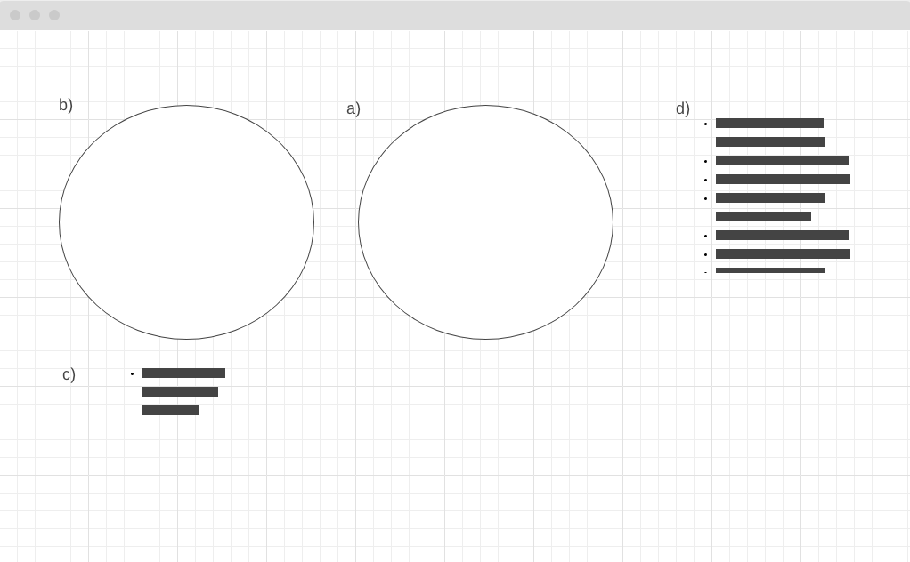

## Best Clash Royale Players: Data Visualization Version 1.0

### Live Link

https://esunwookim619.github.io/bestClashPlayers/

### Background and Overview

  Clash Royale is a popular mobile game made by Supercell. As one of the top
  games from the Google Play Store, it is enjoyed by many and is even played
  competitively: featuring global rankings and pro tournaments. Due to its 
  competitive nature, statistics of gameplay is important to many players. 
  Best Clash Royale Players features the best players around the world along 
  with some of their game stats.

### Architecture and Technologies 

  * D3.js for interactive visualization
  * Javascript
  * Webpack to bundle and serve up various scripts
  * Clash Royale API

### Wireframe

  This visualization consists of a single screen containing a spinning globe (a) and interactive pie charts (b).
  

  The globe allows the user to visualize the locations of the top ranked players. The pie charts can be toggled to see the different stats of each player. The text (c) under each pie chart will display the actual number data from the pie chart along with the player's best trophy score. The text on the far right (d) lists more detailed instructions to help the user navigate through the page.

### Implementation Timeline

  Day 1: 
  * Set up project's webpack
  * Figure out how to retrieve information from Clash Royale API
  * Go through tutorials for D3
  
  Day 2:
  * Set up the spinning globe feature using D3
  * Retrieve data from Clash Royale API to mark locations on globe

  Day 3: 
  * Set up pie charts for win rates for various game modes
  * Set up toggle feature or some other UI so switch between graphs

  Day 4:
  * Clean up features and make page visually appealing

### Functionality and MVP Features

  Users will be able to:
  * View the locations of the top ranked players

      The globe was done using d3.geoOrthographic() along with its path 
      features.

  

      The Stop and Resume buttons were implemented by keeping tracking of the 
      time when utilizing .stop() and .restart().

  

  * Toggle between different sets of data

      Toggling effect was done by implementing an update method that redrew the
      pie chart with a new set of data. 

  * See each player's best trophy record.

### Future Implementations

Data had to be static due to restrictions on fetching data through the Clash
Royale API. Will implement feature to work around that where new data will only
be fetched every 24 hours using some sort of timer.

